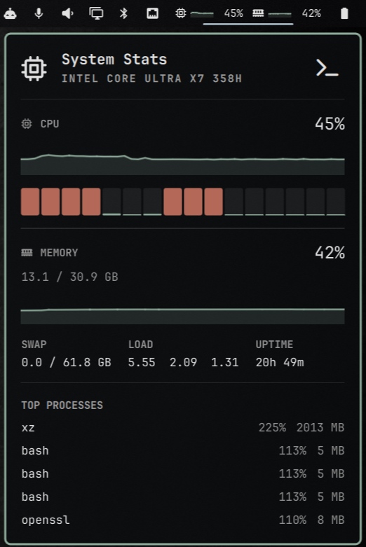

# System Stats

CPU and memory usage in the [Omarchy](https://omarchy.org/) bar, with a detail
panel on click. Built for Omarchy 4 ("Quattro") and its Quickshell bar.



Clicking either readout opens a panel:

- a **header** naming the machine's CPU, with a shortcut to `btop`
- **CPU** — usage, history, and one meter per core
- **MEMORY** — usage, history, used against total
- **swap, load average and uptime**
- **top processes**, by instantaneous CPU

Right-clicking the bar readout opens `btop` directly, without the panel.

## Why another one

Because the bar half never leaves the shell process.

Widgets of this kind usually poll by spawning a helper — a Python script, a
shell pipeline — every couple of seconds, on every monitor. That is an
interpreter start, a fork and an exec for two numbers you could have read
directly. This one reads `/proc/stat` and `/proc/meminfo` from inside the
shell with Quickshell's `FileView`, so the steady-state cost of the bar
widget is two small file reads per interval and some arithmetic.

The one exception is the process list in the panel, which shells out to
`stats-top` — and only while the panel is actually open. Set `topProcesses`
to `0` and the plugin never spawns anything at all.

## Install

```bash
omarchy plugin add https://github.com/flohessling/omarchy-stats.git
omarchy plugin enable flohessling.stats
omarchy bar move flohessling.stats --section right
```

Requires Omarchy 4 or newer. `awk`, `sort` and `sleep` are needed for the
process list; everything else is procfs.

## Settings

Per-instance, in the widget's entry in `~/.config/omarchy/shell.json`:

| Key | Default | What it does |
|---|---|---|
| `intervalMs` | `2000` | Bar sampling period, and the CPU averaging window |
| `panelIntervalMs` | `1000` | Sampling period while the panel is open |
| `sparklines` | `true` | History strips next to the bar percentages |
| `cores` | `true` | Per-core meters in the panel |
| `topProcesses` | `5` | Rows in the process list; `0` removes it entirely |
| `alertPercent` | `90` | Usage at or above this switches the readout and its chart to the alert color |
| `chartColor` | *theme, else `accent`* | Theme token for sparklines and core meters below the threshold |
| `chartAlertColor` | *theme, else `urgent`* | Theme token for sparklines at or above it |
| `cpuIcon` / `memoryIcon` | `` / `` | Glyphs, for fonts that lack these |
| `clickCommand` | `omarchy-launch-or-focus-tui btop` | Run on right-click and from the panel header; empty hides the header button |

```json
{ "id": "flohessling.stats", "intervalMs": 3000, "topProcesses": 0 }
```

The header button labels itself from the command it runs — point
`clickCommand` at `htop` and its tooltip reads "Open htop".

## Colors

Nothing is hardcoded: every color is a *token* resolved against the active
theme, so the widget follows `omarchy theme set` without configuration.

Chart colors resolve in three steps, and you normally touch none of them:

1. `chartColor` / `chartAlertColor` on the widget, if set
2. a `[stats]` section published by the active theme
3. `accent` and `urgent`, which every theme has

### Themes: publishing your own chart colors

Step 2 exists because Quattro's palette has no green. `red` / `color1` from
`colors.toml` becomes `urgent`, but `color2` never gets a semantic name, so a
theme's green is unreachable by any standard role.

`omarchy-theme-set-templates` globs every `shell.*.toml` in a theme directory
and appends the section when the generated `shell.toml` has no block by that
name — so a theme can ship a `shell.stats.toml` and have it picked up with no
configuration on the user's side:

```toml
# shell.stats.toml — becomes [stats] in the generated shell.toml
chart       = "#8DAA9A"
chart-alert = "#b46958"
```

Both accept the same forms as the settings: a palette role (`accent`,
`urgent`, `muted`, `foreground`), another `shell.toml` key such as
`hyprland.active-border`, or a literal `#rrggbb`. Everything re-resolves on
`omarchy theme set`, so nothing needs restarting.

Per-core meters alert on their own load against the same threshold, so a
couple of saturated cores show up red while the aggregate chart is still
calm — which is exactly what a parallel build looks like.

## What the numbers mean

**CPU** is the busy share of all cores over the last interval, from the jiffy
counters in `/proc/stat`; `idle` and `iowait` both count as idle. Per-core
meters are the same calculation per `cpuN` line.

**Memory** is `MemTotal - MemAvailable`, the kernel's own estimate of what is
actually unavailable. It is deliberately not `MemFree`, which counts the page
cache as used and makes a healthy machine look full.

**Top processes** are ranked by *instantaneous* CPU, sampled by diffing
`utime + stime` in `/proc/<pid>/stat` over 0.4s — what `top` and `htop` show.
`ps -eo %cpu` reports a process's average over its whole lifetime instead,
which floats something that was busy an hour ago to the top of an idle
machine. Percentages are relative to one core, so a multi-threaded process
can exceed 100%. Ties are broken by resident memory. Names come from the
kernel's `comm`, which is capped at 15 characters.

## License

MIT
